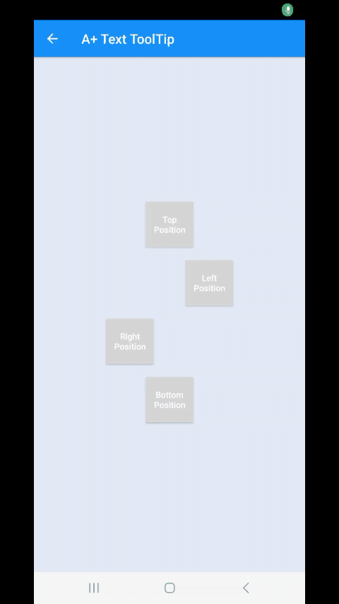

</br><b>Text-ToolTip</b> Es un sistema que te permitira crear mensajes flotantes utiles para espesificar algún botón de acción.
    </br> </br>
 


## Importación
 
Agrega el archivo "TextTooltip.java" a tú proyecto.

## Inicio

Para agregar un ToolTip debes colocar el siguiente código:

```java
//Actividad y Objetivo
TextTooltip.on(Main.this, mybutton)
 //Posisción = TOP, BOTTOM, LEFT y RIGHT
 .position(TextTooltip.Position.TOP)
 //Alineacion CENTER y END
	.align(TextTooltip.ALIGN.CENTER)
	.padding(3, 3, 3, 3)
	.margin(8, 0, 8, 0)
	//Color de fondo
	.color(0xFFE1EAF3)
	//Color de borde y grosor
	.border(0xFF006492, 0)
	//Texto
	.text("TextToolTip")
	//Color del texto 
 .textColor(0xFF303135)
 //Tamaño del texto
	.textSize(16)
	.textGravity(Gravity.CENTER_VERTICAL | Gravity.CENTER_HORIZONTAL)
	.distanceWithView(0)
	//Ocultar con un click = true y false
	.clickToHide(false)
	//Ocultar o mostrar sombra
	.withShadow(false)
	//Ocultar automaticamente despues de "" milisegundos
	.autoHide(true, 1500)
	.arrowTargetMargin(8)
 .arrowSourceMargin(0)
	.arrowHeight(15)
	.arrowWidth(15)
	//Animación = FadeTooltipAnimation, TextTooltip.CardFlipTooltipAnimation, TextTooltip.ZoomTooltipAnimation y TextTooltip.RotateTooltipAnimation + Tiempo de animación
	.animation(new TextTooltip.FadeTooltipAnimation(200))
	
	.show();
```

Eventos:

```java
.onDisplay(new TextTooltip.ListenerDisplay() {
 @Override
	 public void onDisplay(View view) {
			//Cuando se muestra				                 
	}})
.onHide(new TextTooltip.ListenerHide() {
		@Override
   public void onHide(View view) {
				//Cuando se oculta
 }})
 ```

 Recuerda que los eventos van agregados antes de show();
